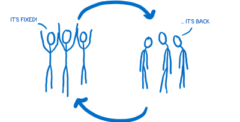
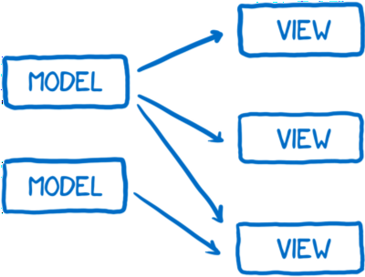
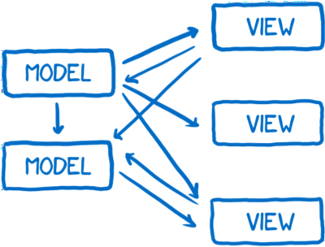

Flux là một trong những chủ đề nóng hổi cũng như khó hiểu trong phát triển web hiện tại.
Bài viết này sẽ cố gắng để giải thích Flux theo cách đơn giản nhất.

## Vấn đề

Đầu tiên, mình sẽ giải thích vấn đề mà Flux sinh ra để giải quyết.
Flux là một quy trình để xử lí dữ liệu trong ứng dụng của bạn.
Flux và React cùng được phát triển tại Facebook. Nhiều lập trình viên dùng
cả hai trong ứng dụng, nhưng mà các bạn có thể dùng chúng riêng lẻ.
Flux và React được phát triển để giải quyết một số vấn đề mà Facebook gặp phải.

Trong số những vấn đề đó thì điển hình nhất là lỗi của thanh thông báo.
Bạn đăng nhập vào Facebook, bạn sẽ thấy thông báo trên biểu tượng chat.

Kì lạ thay, bạn nhấn vào biểu tượng chat thì không có tin nhắn nào cả.
Sau khi lướt news feed vài phút thì thông báo xuất hiện lại.
Bạn nhấn vào biểu tượng chat lần nữa ... vẫn không có bất kì tin nhắn nào.
Vấn đề này cứ tiếp diễn thành một vòng lặp.

Vấn đề nêu trên khi chỉ là vòng lặp cho người dùng mà nó cũng là
vòng lặp cho các kĩ sư Facebook. Họ sửa bug này, mọi thứ hoạt động bình thường
rồi lỗi này lại xuất hiện. Các kĩ sư tiếp tục sửa lỗi, rồi nó cứ xuất hiện
trở lại.

## Vấn đề cốt lõi

Vấn đề cốt lõi được các kĩ sư xác định là do cách mà dữ liệu di chuyển trong
ứng dụng.

Họ có model để lưu dữ liệu, sau đó truyền dữ liệu đến view để render.
Bởi vì người dùng tương tác thông qua view, nên view cần phải cập nhật model
dựa trên tương tác của người dùng. Model thì nhiều khi lại cần cập nhất model
khác.

Thêm vào đó, nhiều khi một tương tác sẽ kích hoạt dây chuyền các thay đổi khác
trong model. Hãy tưởng tượng nhưng bạn chơi trò Pong, bạn sẽ không thể nào
biết được quả bóng sẽ chạm vào đâu (hoặc là rơi ra khỏi màn hình).

