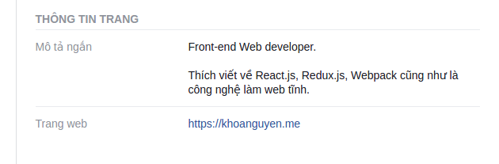

## Giới thiệu

Đi câu cá hay mấy anh Tây hay gọi Phishing có nghĩa là lừa đảo nhằm đánh cắp tài khoản, mật khẩu, thẻ tín dụng của người dùng. Bài viết này sẽ giới thiệu các bạn cách câu cá với thuộc tính `target="_blank"` của trình duyệt.

## Cách thức

Nếu bạn dùng thuộc tính `target="_blank"` trên một liên kết mà không kèm thuộc tính `rel="noopener noreferrer"` để mở một trang web không thuộc quyền kiểm soát của bạn. Trang vừa mở sẽ truy cập được toàn bộ `window` object của bạn thông qua `window.opener`

Đoạn mã dưới đây sẽ minh họa điều đó

```js
if (window.opener) {
  window.opener.location = "https://khoanguyen.me/phishing-target-blank/landing.html?referrer="+document.referrer
}
```

Đâu có gì nghiêm trọng phải không nào? Hãy thử tưởng tượng `https://khoanguyen.me/phishing` là một trang mồi của mấy anh câu cá với giao diện đăng nhập như trang của bạn, người dùng sẽ bị mất mật khẩu một cách dễ dàng.

## Ví dụ

1. Vào fanpage [Khoa Nguyen dot me](https://www.facebook.com/khoanguyendotme/about)
2. Bấm Like giúp mình (câu like rẻ tiền)
3. Bấm vào liên kết `khoanguyen.me`. Một thẻ/ cửa sổ trình duyệt mới sẽ mở ra
4. Chú ý thẻ ban đầu (Facebook.com) đã được chuyển tới trang [này](https://khoanguyen.me/phishing-target-blank/landing.html)



## Khắc phục

Cách khắc phục là chèn thuộc tính `rel="noopener noreferrer"` vào tất cả các liên kết có thuộc tính `target="_blank"`. Hoặc ít nhất là vào những liên kết do người dùng chèn vào.

Và trên hết, nếu bạn phát hiện trang web nào có lỗ hổng này, hãy báo ngay cho quản trị của các trang web đó để khắc phục
