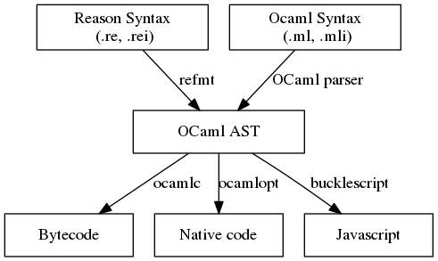
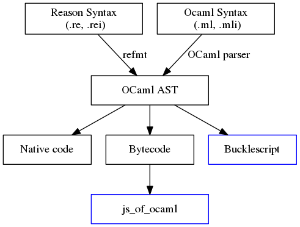

[ReasonML](https://reasonml.github.io/) advertises itself as **Syntax and toolchain for OCaml**. In this article, I'll try my best to explain what ReasonML offers to the OCaml toolchain.

# What is ReasonML?

ReasonML is a new dialect of OCaml which aims as Javascript developer. It was initiated by Facebook as a way to improve how front end developers write code by avoiding lots of bugs caused by Javascript not having a sound type system. For a more in-depth explanation and introduction to ReasonML, you can take a look as [this series by Dr. Axel Rauschmayer](http://2ality.com/2017/11/about-reasonml.html)

# What do you mean by a new dialect of OCaml?

Take a look at this diagram (credit to Dr. Axel Rauschmayer):

OCaml's compiler is pretty unique, it's a set of pluggable parts that can be replaced and used together. This allows ReasonML to be a new dialect on top of OCaml toolchain, it's not a new language (unlike Flow, Typescript,.... which compiles to Javascript). The only different between ReasonML and OCaml is the syntax. All semantics are the same. `refmt` turns RE files into OCaml AST so any tools that works with OCaml would work with ReasonML syntax without modification. Some tools like dune (jbuilder) supports ReasonML out-of-the-box, which means it runs `refmt` for you under the hood.

## Can I use ReasonML without `refmt`?

This question poped up a lot on Discord. Beside turning RE files to OCaml AST, `refmt` can pretty print your RE files (this is like gofmt or prettier). This is enabled by default in VS Code ReasonML plugin (at least for me) so I think this is what confused users. You can disable the pretty print function but you can't use ReasonML without `refmt`.

# Bucklescript

[Bucklescript](https://bucklescript.github.io/) is a backend for OCaml and a seperate project from ReasonML. It's being developed by folks at Bloomberg. It compiles your ReasonML/OCaml code into optimized JS code. Eventhough being a seperated project from ReasonML, they are often referenced at a unit. In my humble opinion, ReasonML can't be succeed without Bucklescript.

## What is the different between `js_of_ocaml` and Bucklescript?

Before Bucklescript, there is `js_of_ocaml` (JSOO) which also compile OCaml to JS. Eventhough they have the same goal, they target different use case:

* JSOO helps you compile your existing OCaml project to have it run in the browser with as little code modification as possible. In another words, JSOO targets OCaml folks.
* Bucklescript on the other hand, provide the best tool for interoping between ReasonML/OCaml and JS. It main target is JS folks.

Furthermore, Bucklescript and JSOO operates at different level in the compiler toolchain.
You can learn more about the differences between the two of them [in Bucklescript docs](https://bucklescript.github.io/docs/en/comparison-to-jsoo.html).

Bucklescript operates at higher level in the compiler tool chain than JSOO. This means JSOO could use advanced tools to do whole program tree-shaking (I forgot the name). Bucklescript on the other hand, outputing hints that JS bundlers could use for tree-shaking. This isn't ideal but it's already an incredible work by Bucklescript team. Thank you!

Side note: [Bucklescript's Lead developer Hongbo Zhang have shared the ideas of Bucklescript before making it](https://github.com/ocsigen/js_of_ocaml/issues/338). So I can say that no wheels were invented in the process of making Bucklescript.

# esy - the package manager

ReasonML brings esy, a new package manager to the game. Here is a brief explanation about different package managers in the ecosystem:

* opam: The entire ecosystem of native ocaml is built around these opam packages.
* npm/yarn: The entire ecosystem of JS files are built around this ecosystem.
* [esy](http://esy.sh): Makes opam feel like npm/yarn. Allows access to both ecosystems.

I'll have a post introducing [esy](http://esy.sh) soon. Stay tuned!

# Build systems

ReasonML bring bsb (acronym of Bucklescript) and bsb-native to the game. Here is some available build systems:

* bsb: Build system for JS projects that are composed of other packages that use bsb.
* bsb-native: Like bsb but also compiles those same kinds of projects to native.
* dune (jbuilder)
* Make/ninja
* webpack/rollup

Bucklescript is both a compiler (as it compiles to JS) and a build systems because it has to deal with dependencies and linking,...

# JS developers

It would be a mistake to not mentioning the JS developers ReasonML is bringing to the ecosystem. This helps expanding the user base, push OCaml towards new landscape.

# Conclusion

ReasonML is a promising project and it's moving reall fast. If you want to sleep well at night, try ReasonML. The advanced type system inherited from OCaml with 20 years of development has make it the best. It eliminates a class of bugs that related to type in JS world.

---

You can reach me via Twitter([@khoanguyenme](https://twitter.com/khoanguyenme)) or **@thangngoc89** on Discord channel.
