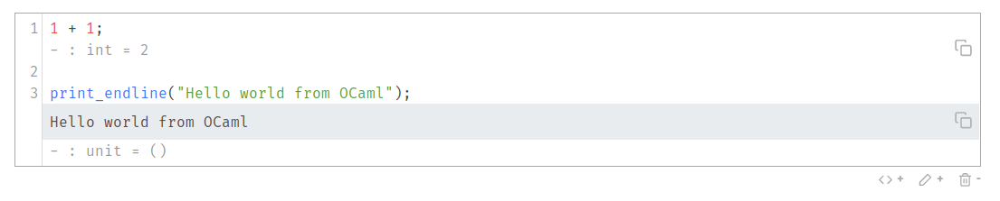

> This post is part of [Sketch.sh development series](https://khoanguyen.me/sketch)

Alright folks, [in the first post](/sketch), I introduced briefly about [js_of_ocaml](https://ocsigen.org/js_of_ocaml) being used for executing the code in the browser. I call this part of the code base [**Sketch engine**](https://github.com/Sketch-sh/engine).

# Overview about OCaml's REPL

Official distribution of OCaml comes with a built-in REPL (OCaml folks usually call them Toplevel). you can execute it by typing `ocaml` in your shell. Though it works, the user interface is very primitive so [utop](https://opam.ocaml.org/blog/about-utop/) was born to address the problem. utop has an excellent user interface with context aware code completion and better typing experience. utop is the best REPL I've ever used. 

> You might wondering what is the relation between `rtop` and `utop`? 
> 
> `rtop` is an `utop` version that supports ReasonML syntax. 
> We'll explore about it closely in this post as well.

```
$ ocaml
    OCaml version 4.02.0+dev12-2014-07-30

# 1 + 1;;
- : int = 2
```

Toplevel provides an interactive interface over the module Toploop. It works by compiling the input code into **bytecode**, executing and getting the result back.

# js_of_ocaml

[js_of_ocaml](https://ocsigen.org/js_of_ocaml) is a compiler for compiling OCaml **bytecode** to Javascript. Bytecode backend is relatively stable so maintaining `js_of_ocaml` for newer compiler releases doesn't require much effort.

For compiling from OCaml bytecode to Javascript with js_of_ocaml, you need to link the package `js_of_ocaml` and the ppx `js_of_ocaml-ppx` with ocamlc.

```sh
ocamlfind ocamlc -package js_of_ocaml -package js_of_ocaml-ppx \
    -linkpkg -o my_app.byte my_app.ml
```

By calling `js_of_ocaml` on the output bytecode, you get a `my_app.js` file ready to be embed in your website.

```
js_of_ocaml my_app.byte
```

# Goals of this post

As Sketch's codebase changes rapidly, it would be hard to document the code and explain about each module. Instead, I'm going to walk you through building a naive version of Sketch engine. I hope that you can easily understand Sketch's codebase after this. 

There are several code examples in this post, they are located [here](https://github.com/thangngoc89/blog/tree/master/content/sketch/examples). 

I'm using [esy](https://esy.sh) as the packages manager so you need to have Node.js available and install esy:

```
npm install --global esy
```

Clone the code:

```
git clone https://github.com/thangngoc89/blog
cd content/sketch/examples
esy install
esy build
```

You can run `esy build` for building all the examples. In each section, details instruction will be given.

# First version of Sketch engine

So getting back to our Sketch engine, `Toploop` can be compiled to Javascript by default and that's great because it's the heart of our Sketch engine. In the early version of Sketch engine, I used `JsooTop` module which is an abstraction over `Toploop` module providing by `js_of_ocaml-toplevel` package.

Our first version of the engine is simple, you expose a function that take the source code and return the result:


```reason
open Js_of_ocaml;

let execute: Js.t(Js.js_string) => Js.t(Js.js_string) = code => {
  let code = Js.to_string(code);
  let buffer = Buffer.create(100);
  let formatter = Format.formatter_of_buffer(buffer);
  JsooTop.execute(true, formatter, code);
  let result = Buffer.contents(buffer)
  Js.string(result);
};
```

Because `js_of_ocaml` doesn't use Javascript types for representing OCaml types. You need to convert from `Js.t(Js.js_string)` to `string`:

```reason
let code = Js.to_string(code);
```

Next, we need a formatter for storing the evaluated result of the code:

```reason
let buffer = Buffer.create(100);
let formatter = Format.formatter_of_buffer(buffer);
```

Notice how we need to pass a buffer to the formatter? Buffers are extensible strings, you create it with an estimated initial size. Don't worry about the size that much, it will grow to fit the dataset. 

The next step would be executing the code with `JsooTop.execute` function:

```reason
JsooTop.execute(true, formatter, code);
```

Buffers are mutable so we can get the result back as a string like this:

```reason
let result = Buffer.contents(buffer)
```

Finally, convert from `string` to `Js.t(Js.js_string)` and return it. That's pretty simple right? We get ourselves a working engine in 8 lines of code. Asides from the main `execute` function, you need to have these lines as well:

```reason
JsooTop.initialize();
let () = Js.export_all(
  [%js {
    val execute = execute
  }]
);
```

The first line is for initialization of the toplevel, it does several things like populating the toplevel environment, setting up look-up paths,... but we don't need to worry about it right now.

The next line, we are telling `js_of_ocaml` that "Hey, we want the `execute` function to be callable in Javascript side" and `js_of_ocaml` exports it as `window.execute` if you embed the script or `const { execute } = require("./engine.bc.js")` if you're requiring it from Node.js.

You can build our first version of the engine with this command:

```
esy dune build one/engine.bc.js --profile release
```

The generated file is located in `_build/default/one/engine.bc.js`, let's try that in Node REPL:

```bash
❯ node
> const { execute } = require("./_build/default/one/engine.bc.js")
undefined

> execute("1 + 1;;")
'- : int = 2\n'
```

Great! So we got ourselves a usable engine that you can embed in your website or calling it from Node.js. But this naive version of the engine has some limitations:

- Errors and logs (stdout, stderr in OCaml) is printed directly to Javascript console, we want to catch them and return them as result of `execute` function for displaying in the UI.

```bash
> execute(`print_endline "Hello world from OCaml";;`);
Hello world from OCaml
'- : unit = ()\n'

> execute(`syntax error`);
File "", line 1, characters 12-12:
Error: Syntax error
''
```

- It executes all code at once. We want it to return the result for each individual statement (they are called phrases in OCaml's terminology).

```bash
> execute(`let add = (+);; add 1 2;; add 3 4;;`);
'val add : int -> int -> int = <fun>\n- : int = 3\n- : int = 7\n'
```

- It doesn't support ReasonML syntax yet.

# Turn `stdout` and `stderr` into values

`stdout` and `stderr` are `out_channel`. They are flushed to Javscript console by default but we can flush them into a buffer instead.

```reason
let stderr_buffer = Buffer.create(100);
let stdout_buffer = Buffer.create(100);

Sys_js.set_channel_flusher(stdout, Buffer.add_string(stdout_buffer));
Sys_js.set_channel_flusher(stderr, Buffer.add_string(stderr_buffer));
```

Add these lines to the end of `execute` function: 

```reason
let result = Buffer.contents(buffer);
let stderr_result = Buffer.contents(stderr_buffer);
let stdout_result = Buffer.contents(stdout_buffer);

Buffer.clear(stderr_buffer);
Buffer.clear(stdout_buffer);

[%js {
  val result = Js.string(result);
  val stderr = Js.string(stderr_result);
  val stdout = Js.string(stdout_result)
}]
```

Here we bind the content of execution result, stderr and stdout into variables and clear the buffer after that. We also return an Javascript object with this shape:

```js
{
  result: string,
  stderr: string,
  stdout: string
}
```

You can build this example with:

```
esy dune build two/engine.bc.js --profile release
```

Test it:

```
❯ node
> const { execute } = require("./_build/default/two/engine.bc.js")
undefined

> execute("1 + 1;;")
{ result: '- : int = 2\n', stderr: '', stdout: '' }

> execute(`print_endline "Hello world from OCaml";;`);
{ result: '- : unit = ()\n',
  stderr: '',
  stdout: 'Hello world from OCaml\n' }

> execute(`syntax error`);
{ result: '',
  stderr: 'File "", line 1, characters 12-12:\nError: Syntax error\n',
  stdout: '' }
```

That looks more promising! We get `stderr` and `stdout` as return values. In Sketch UI, This information will be display inline like this



# Support ReasonML syntax

As I mentioned above, `rtop` is `utop` with ReasonML syntax support. Adding ReasonML syntax, we need to install `reason` package first:

```
esy add @esy-ocaml/reason
```

Add these lines before `JsooTop.initialize();` in `engine.re`:

```reasonml
let reasonSyntax = () => {
  open Reason_toolchain.From_current;
  let wrap = (f, g, fmt, x) => g(fmt, f(x));
  Toploop.parse_toplevel_phrase :=
    Reason_util.correctly_catch_parse_errors(x =>
      Reason_toolchain.To_current.copy_toplevel_phrase(
        Reason_toolchain.RE.toplevel_phrase(x),
      )
    );
  Toploop.parse_use_file :=
    Reason_util.correctly_catch_parse_errors(x =>
      List.map(
        Reason_toolchain.To_current.copy_toplevel_phrase,
        Reason_toolchain.RE.use_file(x),
      )
    );
  Toploop.print_out_value :=
    wrap(copy_out_value, Reason_oprint.print_out_value);
  Toploop.print_out_type := wrap(copy_out_type, Reason_oprint.print_out_type);
  Toploop.print_out_class_type :=
    wrap(copy_out_class_type, Reason_oprint.print_out_class_type);
  Toploop.print_out_module_type :=
    wrap(copy_out_module_type, Reason_oprint.print_out_module_type);
  Toploop.print_out_type_extension :=
    wrap(copy_out_type_extension, Reason_oprint.print_out_type_extension);
  Toploop.print_out_sig_item :=
    wrap(copy_out_sig_item, Reason_oprint.print_out_sig_item);
  Toploop.print_out_signature :=
    wrap(List.map(copy_out_sig_item), Reason_oprint.print_out_signature);
  Toploop.print_out_phrase :=
    wrap(copy_out_phrase, Reason_oprint.print_out_phrase);
};
```

What's going here? `Toploop` module contains several functions for parsing  and printing values: `parse_toplevel_phrase`, `parse_use_file`, `print_out_*`,... These functions are mutable so we can swap out the original OCaml parser and printer with ReasonML ones. [I didn't figure this out myself, the ReasonML team did](https://github.com/facebook/reason/blob/9914cc69934991b485943847a9196d0d3576d603/src/rtop/reason_utop.ml#L60-L77).

We also need to copy `reason_utils.ml` from [rtop's source code](https://github.com/facebook/reason/blob/9914cc69934991b485943847a9196d0d3576d603/src/rtop/reason_util.ml) to our project. I chose to vendor this file instead of installing it because `rtop` depends on `utop`, and that's a heavy dependencies with lots of primitives that `js_of_ocaml` can't compile to Javscript.

You can build this example with:

```
esy dune build three/engine.bc.js --profile release
```

Let's test it:

```bash
> const { execute } = require("./_build/default/three/engine.bc.js")
undefined

> execute(`print_endline("Hello from " ++ "ReasonML");`);
{ result: '- : unit = ()\n',
  stderr: '',
  stdout: 'Hello from ReasonML\n' }
```

You can notice the `++` operator for string concatenation as well as semicolon as expression seperator indicating ReasonML syntax. If you try the OCaml syntax again, you'll get syntax error:

```bash
> execute(`print_endline ("Hello from " ^ "OCaml") ;;`);
{ result: '',
  stderr: 'File "", line 1, characters 31-41:\nError: Syntax error\n',
  stdout: '' }
```

This is understandable since we replaced OCaml parser and printer with Reason ones. What if we want to support both OCaml and ReasonML syntax at the same time just like [https://sketch.sh]? A naive solution would be keeping 2 seperate version of the engine but `engine.bc.js` weights about 5.0MB. That's huge for a client-side Javascript file.

# Wrapping up

Whoops. That's a lot of stuff going on. In this post, I showed you how to build the simplest version of our engine, turn `stdout` and `stderr` into first class values and add ReasonML syntax support.

I want to thank you Matthias Kern and Bryan Phelps for giving me early feedbacks about this post.

# What's next?

In the next post, I'll explain about supporting OCaml and ReasonML at the same time as well as getting result for each invidiual phrase
