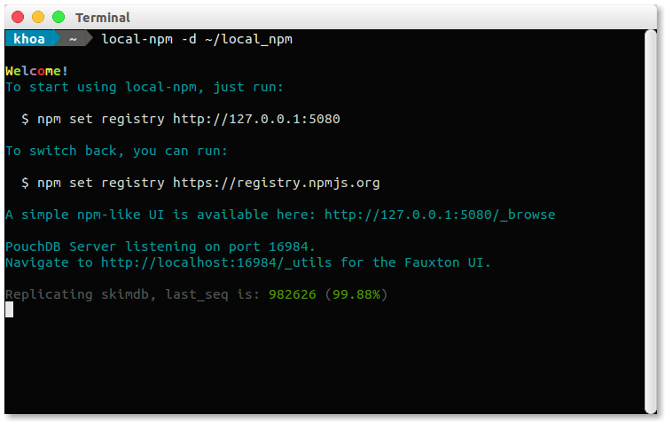
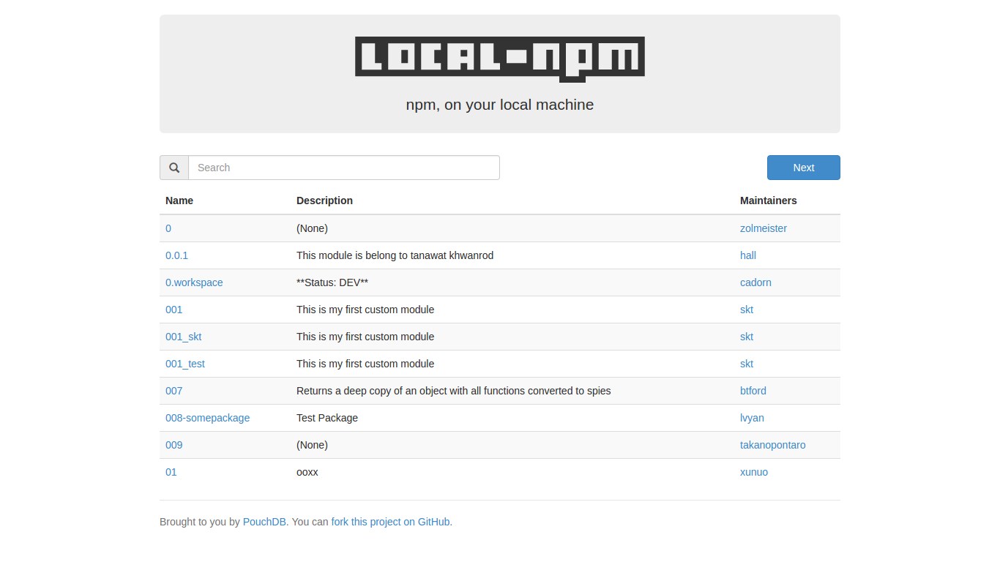
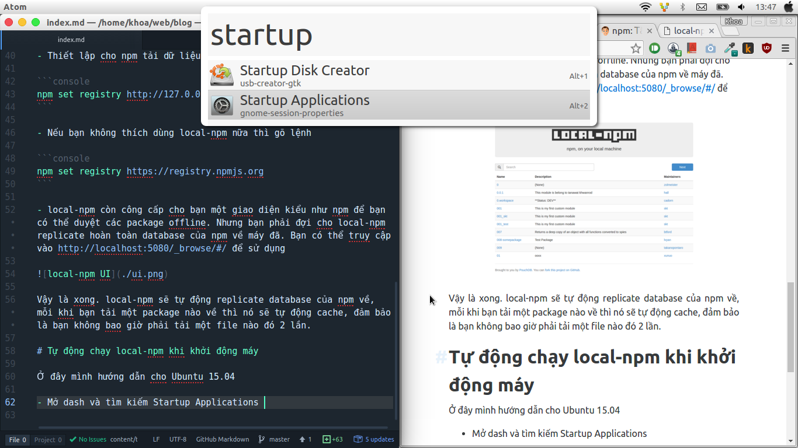
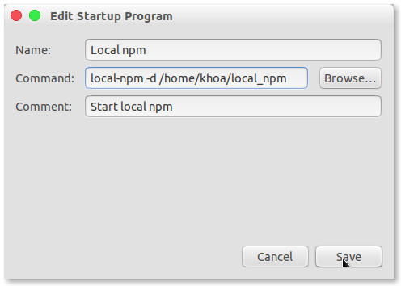

Chắc chắn là ai đã từng làm việc với npm thì đều biết một điều rằng npm nó siêu chậm. Vì vậy mình hay hạn chế chạy `npm install` đến mức tối thiểu và thường không nhận được patch update, ... cũng như nhiều vấn đề khác phát sinh. Trong bài viết này mình sẽ giới thiệu với các bạn một package không những giúp tăng tốc npm mà còn cho phép bạn cài đặt package offline.

# [local-npm](https://github.com/nolanlawson/local-npm)

[local-npm](https://github.com/nolanlawson/local-npm) sẽ tạo ra 1 replicate cho toàn bộ database của npm (chỉ hơn 1GB một tí thôi) cũng như là cache các package đã tải về. Vì vậy bạn sẽ không bao giờ tải một file 2 lần.

## Sử dụng

- Cài đặt

```console
npm install --global local-npm
```

- Tạo một thư mục để chứa dữ liệu

```console
mkdir ~/local_npm
```

- Chạy local-npm server

```console
local-npm -d ~/local_npm
```

- Lúc này bạn sẽ thấy giao diện chính của chương trình xuất hiện



- Thiết lập cho npm tải dữ liệu từ local-npm

```console
npm set registry http://127.0.0.1:5080
```

- Nếu bạn không thích dùng local-npm nữa thì gõ lệnh

```console
npm set registry https://registry.npmjs.org
```

- local-npm còn cung cấp cho bạn một giao diện kiểu như npm để bạn có thể duyệt các package offline. Nhưng bạn phải đợi cho local-npm replicate hoàn toàn database của npm về máy đã. Bạn có thể truy cập vào [http://localhost:5080/_browse/#/] để sử dụng



Vậy là xong. local-npm sẽ tự động replicate database của npm về, mỗi khi bạn tải một package nào về thì nó sẽ tự động cache, đảm bảo là bạn không bao giờ phải tải một file nào đó 2 lần.

# Tự động chạy local-npm khi khởi động máy

Ở đây mình hướng dẫn cho Ubuntu 15.04

- Mở dash và tìm kiếm Startup Applications



- Tạo mới một entry để tự khởi động command ở trên mỗi khi mở máy



Done. npm is not a jerk anymore. :D
