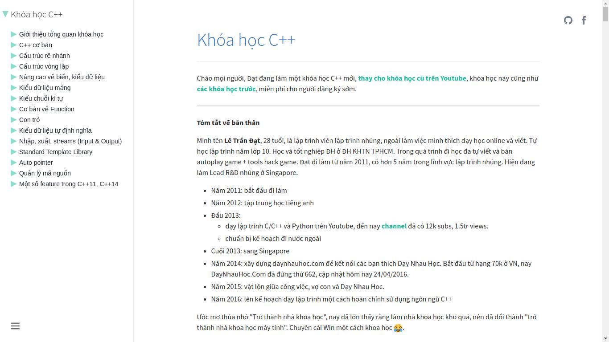

Nếu bạn là thành viên của [Dạy Nhau Học (DNH)](http://daynhauhoc.com) thì các bạn có
thể đã biết đến khóa học của [anh Đạt admin (@ltd)](http://daynhauhoc.com/users/ltd/activity)

Khóa học này (có phí) gồm các [video được đăng trên Udemy](https://www.udemy.com/c-co-ban-danh-cho-nguoi-moi-hoc-lap-trinh/) kèm với
đó là [trang web đăng tải các bài học miễn phí](http://cpp.daynhauhoc.com).

[](http://cpp.daynhauhoc.com)

Trong bài viết này mình sẽ giới thiệu các công nghệ đã sử dụng để tạo ra một
trang web tương tự mà không tốn chi phí hosting cũng như là thời gian để quản
lí và nâng cấp.

# Web tĩnh (static website)

Web tĩnh có nghĩa là máy sẽ gửi trực tiếp các file HTML về cho người dùng mà
không cần phải phải qua xử lí với PHP, Node.js, Ruby hay bất kì ngôn ngữ nào.

Ưu điểm của static website:

## An toàn

Chẳng có bất kì logic để hacker lợi dụng ở đây. Nếu hacker có vào được
máy chủ của bạn thì thứ mà hắn ta thấy chỉ là các file HTML. Bạn không cần là một
hacker cũng có thể tải tất cả các file này về với một dòng lệnh

```sh
$ wget \
     --recursive \
     --no-clobber \
     --page-requisites \
     --convert-links \
     --restrict-file-names=windows \
     --domains website.org \
     --no-parent \
         www.website.org/tutorials/html/
```

(Nguồn: [Linux Journal](http://www.linuxjournal.com/content/downloading-entire-web-site-wget))

## Nhanh

Máy chủ chỉ việc gửi các file HTML có sẵn về nên truy cập web tĩnh
sẽ siêu nhanh. Có thể đạt tốc độ mili giây mà không cần phải tối ưu hóa gì

## Rẻ

Vì web tĩnh là một xu hướng hiện nay nên có nhiều dịch vụ chuyên về hosting
cho web tĩnh. Một số dịch vụ còn miễn phí. Ví dụ:

- [Github Pages](https://pages.github.com) - Miễn phí hoàn toàn. Mình dùng
Github Pages để host website Học C++
- [Gitlab Pages](https://pages.gitlab.com) - Miễn phí hoàn toàn
- [Amazon S3 + Amazon Cloudfront](https://aws.amazon.com) - Trả phí, tính theo
  dung lượng và băng thông
- [Netlify](https://netlify.com) - Miễn phí kèm các gói nâng cấp từ $9 đến $49/ tháng
- [Surge.sh](https://surge.sh) - Miễn phí kèm gói nâng cấp $9
- [Aerobatic](https://www.aerobatic.com/) - Miễn phí kèm với các gói nâng cấp
  từ $10 đến 200$/ tháng

> Tham khảo thêm :
>
> - [What is a static website](http://nilclass.com/courses/what-is-a-static-website)
> - [Why Static? - by DatoCMS](https://www.datocms.com/why-static/)

# Công cụ tạo trang web tĩnh (Static site generator - SSG)

Vì sao lại cần một công cụ?

Vì viết HTML bằng tay rất dễ bị lỗi và bạn phải lập lại nhiều phần ở mỗi trang
như header, footer, ...

Một vài công cụ nổi tiếng
[Jekyll](http://jekyllrb.com/),
[Hugo](http://gohugo.io/),
[Metalsmith](http://www.metalsmith.io/)

[Staticgen.com](https://www.staticgen.com/) là một danh sách tổng hợp tất cả
các SSG

Ở đây mình chọn [Phenomic](https://phenomic.io). Vì một số lí do sau đây:

- Mình đóng góp một số lượng lớn code vào project này (115 commit tính đến thời
  điểm viết bài)
- Nó dựa trên React.js và mình thì thích React.js
- Trang web tạo ra sẽ giống một web app: chuyển trang dùng history.pushState thay
  vì phải load lại trang từ đầu, và Phenomic chỉ cần load data, không cần phải
  load toàn bộ trang web như các công cụ khác
- Dễ tùy biến, nếu bạn quen làm việc với React.js, Webpack thì bạn sẽ chẳng phải
  học thêm gì. Bắt tay vào code thôi.

# Tải nội dung

- Các bài viết được viết dưới dạng markdown trên diễn đàn DNH.
- [Đây là topic tổng hợp các bài viết của khóa học](http://daynhauhoc.com/t/tong-hop-khoa-hoc-lap-trinh-c-danh-cho-nguoi-moi-bat-dau/29429)
- [Đầu tiên mình sẽ tải file markdown của bài viết tổng hợp ở trên về](https://github.com/thangngoc89/dnh-cpp/blob/4053532715b1e4d678a2fe99483f68fddedb018d/scripts/content/fetch-data.js)
[tại đây](http://daynhauhoc.com/raw/29429)
- [Chuyển cấu trúc trên thành dạng cây](https://github.com/thangngoc89/dnh-cpp/blob/4053532715b1e4d678a2fe99483f68fddedb018d/scripts/content/parse-toc.js)
- [Cuối cùng là tải từng bài viết về và lưu vào thư mục `content`](https://github.com/thangngoc89/dnh-cpp/blob/4053532715b1e4d678a2fe99483f68fddedb018d/scripts/content/download-post.js)

# Tự động tạo và đăng tải website

- Mình dùng [Travis CI](https://travis-ci.org) để tự động tạo và đăng tải website mỗi khi mình push bất kì chỉnh sửa nào lên Github.

> [Hướng dẫn cấu hình Travis CI từ Phenomic](https://phenomic.io/docs/usage/gh-pages/#automatically-with-travis-ci)

- Travis CI cũng đảm nhận việc đăng tải website hoàn thành lên Github

# Tự động tạo trang web mỗi ngày

Vì Travis CI chỉ chạy mỗi khi mình push lên Github nên mình cần phải thiết lập
cronjob tự động kích hoạt Travis CI build mỗi ngày 2 lần để cập nhật các nội
dung mới của khóa học.

Suy nghĩ đầu tiên là dùng một host/ VPS nào đó để thực hiện việc này.

VPS rẻ nhất là cỡ $5/tháng, và chạy một VPS 24/7 để chỉ thực hiện một công việc
mỗi ngày 2 lần là quá phí phạm. (Dù gì thì host toàn bộ trang web chẳng tốn
bất kì chi phí nào mà).

Host free với cronjob cũng là một lưa chọn, nhưng:

- Mình không chơi với PHP nữa :D
- Đoạn script để kích hoạt Travis CI cần Github token của mình nên bỏ token đó
  lên shared host không an toàn tí nào.

Giải pháp của mình là dùng Amazon Lambda kèm với Amazon Cloudwatch để thay thế
cronjob. Mình chọn [Serverless Framework](https://serverless.com/) để tự động
hóa việc upload, và thiết lập Amazon Lambda cho mình. (Vì Dashboard của AWS
rất củ chuối).

Các bạn có thể xem [toàn bộ Lambda function kèm với cấu hình ở đây](https://github.com/thangngoc89/dnh-cpp/tree/4053532715b1e4d678a2fe99483f68fddedb018d/cron)

Chi phí cho Amazon Lambda và Cloudwatch là siêu rẻ. Mình ước tính khoảng
$0.0002/tháng. [- xem chi tiết](https://gist.github.com/thangngoc89/7775c62a93d69800010bdcc0c8889f6c)

# Kết luận

Web tĩnh là một xu hướng hiện nay, dùng đúng công cụ và dịch vụ, các bạn có thể
tạo ra một trang web hoàn toàn miễn phí sẵn sàng phục vụ cho hàng triệu lượt
truy cập mỗi tháng.
