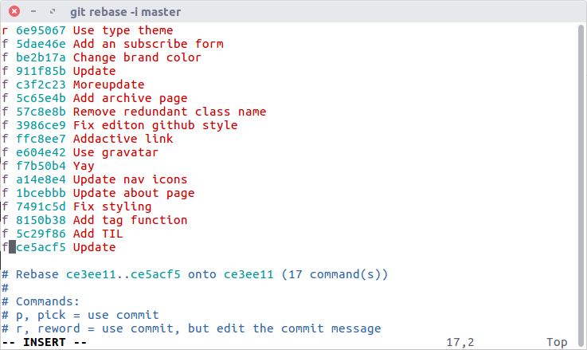

Bình thường:

```sh
git rebase -i master
```

Chọn `r` (rename) để đặt lại tên cho commit đầu
Chọn `f` (fixup) hoặc `s` (squash) trên từng commit



Nhanh hơn

```sh
git reset --soft master
git commit -m "Tên cho commit đầu ở đây"
```
