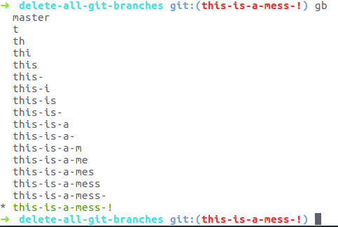

Mình thường tạo ra rất nhiều branch khi làm việc với git. Nhiều khi vài chục
branch cùng một lúc.



Nếu các bạn muốn xóa nhanh tất cả các branch và chỉ chừa lại branch master,
câu lệnh dưới đây dành cho bạn:

```sh
git checkout master && git branch -D `git branch | grep -v master`
```

**!! Câu lệnh trên chạy mà không có bất cứ cảnh báo nào**
